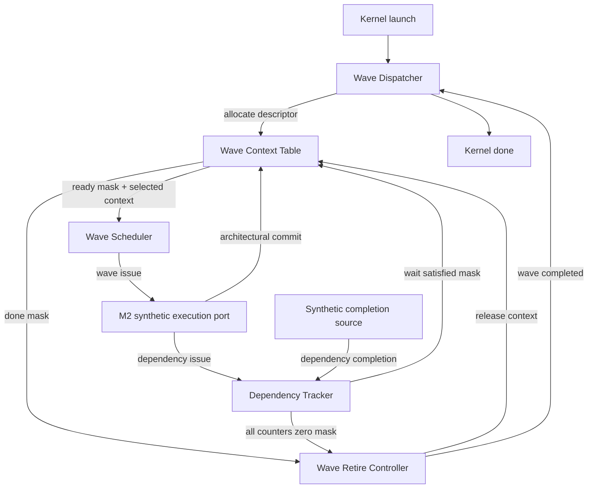
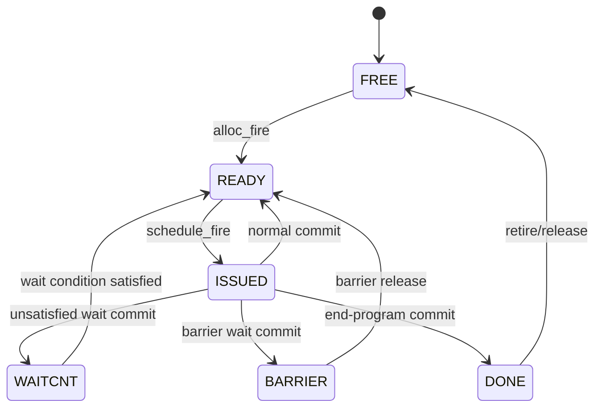

# TinyGPU M2：多 Wave 控制平面规格

版本：M2 architecture freeze v1  
状态：接口冻结，可开始逐模块实现  
前置里程碑：M1 Legacy ISA → `decoded_uop_t` 兼容桥  
最终方向：逐步形成面向 CDNA5 的 Wave32、非阻塞访存与矩阵执行微架构

## 1. M2 的一句话目标

M2 要建立一个可以独立验证的多 Wave 控制闭环：把一次 Kernel 启动拆成多个 Workgroup/Wave，为它们分配常驻 Context，在 Wave 等待长延迟事件时调度其他 READY Wave，并在所有 Wave 安全退出后产生一次 Kernel 完成脉冲。

M2 解决的是“谁可以运行、谁必须等待、状态保存在哪里、何时释放”的问题；它暂时不实现完整 CDNA5 指令执行数据通路。

## 2. M2 完成后的可观察能力

完成 M2 后，仿真必须能够看到以下行为：

1. 一次一维 Kernel 启动被拆成一个或多个 Workgroup。
2. 每个 Workgroup 被进一步拆成一个或多个 Wave32。
3. 最后一个不满 32 个线程的 Wave 具有正确的初始 `EXEC[31:0]`。
4. 最多有 `NUM_WAVE_CONTEXTS` 个 Wave 同时常驻。
5. Context 满时，Dispatcher 通过 `valid/ready` 自动停住，并且保持待分配描述符不变。
6. Scheduler 只从 READY Wave 中选择一个 Wave，初版使用 Round-Robin。
7. 一个 Wave 发出非阻塞访存后，可以回到 READY；其他 Wave 和该 Wave 的无关后续指令可以继续调度。
8. Wave 执行 `S_WAIT_*CNT` 且条件不满足时进入 WAITCNT；条件满足后自动回到 READY。
9. BARRIER 状态及释放通路被保留并可验证，但 M2 不实现完整的 Workgroup Barrier Controller。
10. `S_ENDPGM` 对应的 Wave 进入 DONE；只有依赖计数器安全清零后才被回收。
11. 回收后的 Context 可以再次分配给后续 Wave。
12. 所有 Wave 都完成且全部被回收后，Kernel `done` 只脉冲一个周期。
13. 旧 M1 顶层和六个 Legacy Pattern 的行为保持不变。

## 3. M2 的边界

### 3.1 M2 必须实现

- 单 Kernel 上下文的 Wave 拆分与派发。
- 多个常驻 Wave Context。
- Wave ID 的分配、使用与回收。
- READY Wave 的 Round-Robin 调度。
- 每个 Wave 独立的 PC、EXEC、VCC、SCC、M0 与派发元数据。
- 每个 Wave 独立的 CDNA5 Memory Dependency Counters。
- `S_WAIT_*CNT` 的睡眠与唤醒语义。
- DONE Wave 的安全退休。
- Context 满、执行端反压、事件延迟和 Context 重用。
- 独立的 M2 自检环境及断言。

### 3.2 M2 明确不实现

- 真正的 CDNA5 Fetch/Decode。
- SGPR、VGPR、AccVGPR 物理寄存器文件。
- SALU、VALU、WMMA/MFMA/Tensor 运算数据通路。
- 寄存器 RAW/WAW Scoreboard。
- 真正的 VMEM、SMEM、LDS、TDM 请求与返回网络。
- 完整 Barrier 成员计数、Named Barrier 与 Cluster Barrier。
- Divergence Stack 与 Reconvergence。
- Trap、Exception、XNACK Replay。
- 多 Kernel 并发、CU/WGP 资源分配及跨 CU Dispatch。

这些项目不是被忽略，而是被放到后续里程碑，以避免在基础 Wave 生命周期尚未稳定时同时修改前端、寄存器堆、存储和调度。

## 4. M2 默认配置

| 项目 | M2 默认值 | 说明 |
| --- | ---: | --- |
| Logical Wave size | 32 | 固定 Wave32 教学路径 |
| EXEC/VCC 存储宽度 | 64 bit | Wave32 只使用低 32 位，高 32 位保持 0 |
| PC 宽度 | 64 bit | DWORD 对齐的 byte address |
| 常驻 Context 数 | 4 | `NUM_WAVE_CONTEXTS` |
| Threads per Workgroup | 64 | 默认每个完整 Workgroup 包含两个 Wave32 |
| 最大 Waves per Workgroup | 32 | `wave_id_in_workgroup` 为 5 bit |
| 每周期调度带宽 | 1 Wave | 一个 Scheduler 选择端口 |
| 每 Wave 在途指令 | 1 条 | Wave 从 ISSUED 返回后才可再次调度 |
| Dependency issue event | 最多 1 个/周期 | 后续可扩成多端口 |
| Dependency completion event | 最多 1 个/周期 | 与 issue event 可同周期 |
| Context retire | 最多 1 个/周期 | 初版低编号优先 |

这里的“每 Wave 在途指令 1 条”不等于阻塞访存。访存指令一旦被后端接受，就可以结束本次 Wave issue，Context 回到 READY，而访存请求继续在后端运行并由 Dependency Counter 跟踪。

## 5. M2 顶层微架构



`wave_control_subsystem` 只负责连接这些模块和公开验证端口，不重新保存任何 Wave 状态。

## 6. 逻辑 Wave Context 的拆分

一个“完整 Wave Context”在概念上由三部分组成，但 M2 不把它们硬塞进同一个 RTL 模块：

| 所有者 | M2 保存内容 | 原因 |
| --- | --- | --- |
| `wave_context_table` | 生命周期状态、PC、EXEC、VCC、SCC、M0、Workgroup/Wave 元数据 | Scheduler 和执行前端频繁读取的架构上下文 |
| `wave_dependency_tracker` | 7 类未完成依赖计数器、Wait 选择和阈值 | 后端 completion 可以独立于指令 commit 到达，避免 Context Table 多写口膨胀 |
| 后续 SGPR/VGPR 模块 | Scalar/Vector/Accumulator Register state | 数据容量大，必须独立组织并按资源分配 |

因此，“计数器不在 `wave_context_table` 端口中”是有意的模块边界，不是遗漏。两部分使用同一个 `wave_id` 对齐。

## 7. M2 新增模块与唯一职责

### 7.1 `wave_dispatcher.sv`

职责：接收 Kernel 启动，保存 Kernel 参数，依次生成 Wave 描述符，并统计派发/完成数量。

它负责：

- 保存 `start_pc`、`thread_count`。
- 根据 `THREADS_PER_WORKGROUP` 和 Wave32 计算 Workgroup/Wave 数量。
- 生成 `workgroup_id`、`wave_index_in_workgroup`、`waves_in_workgroup`、`global_thread_base`。
- 为最后一个 Partial Wave 生成初始 EXEC。
- 与 Context Table 进行 `alloc_valid/alloc_ready` 握手。
- 接收 Retire Controller 的 `wave_completed` 脉冲。
- 产生 `busy` 和单周期 `done`。

它不负责选择哪个常驻 Wave 执行，也不保存 Wave 的运行时 PC。

### 7.2 `wave_context_table.sv`

职责：作为常驻 Wave 的小型多表项状态阵列，保存调度状态和架构控制状态。

它负责：

- 查找最低编号 FREE Entry 并返回 `alloc_wave_id`。
- 分配时写入初始 PC、EXEC 和派发元数据。
- Issue 时将 READY 变为 ISSUED。
- Commit 时更新 PC/EXEC/VCC/SCC/M0，并进入指定下一状态。
- WAITCNT 条件满足或 Barrier 释放时恢复 READY。
- Retire 时清除并进入 FREE。
- 输出各状态的 one-hot/multi-hot mask。
- 提供一个组合读端口。

它不保存 Dependency Counter，不进行 Round-Robin 仲裁，也不判断 Wait 阈值。

### 7.3 `wave_scheduler.sv`

职责：从 `ready_mask` 中公平选择一个 Wave，并通过 `valid/ready` 交给执行端。

初版策略：

- 从 `round_robin_pointer` 开始循环扫描。
- 只选择 `ready_mask[wave_id] == 1` 的 Entry。
- 当下游 `ready == 0` 时，保持 `selected_valid` 和 `selected_wave_id` 稳定。
- 仅在 `schedule_fire = selected_valid && selected_ready` 时移动指针。
- `schedule_fire` 同时送给 Context Table，令对应 Entry READY → ISSUED。

Scheduler 不修改 PC、Counter 或任何架构寄存器。

### 7.4 `wave_dependency_tracker.sv`

职责：保存每个 Wave 的 Memory Dependency Counter 和显式 Wait 条件。

每个 Wave 保存：

| Counter | 位宽 | M2 含义 |
| --- | ---: | --- |
| `LOADcnt` | 6 | 未完成 Vector Memory load/atomic-with-return 指令数 |
| `STOREcnt` | 6 | 未完成 Vector Memory store/atomic-without-return 指令数 |
| `DScnt` | 6 | 未完成 LDS/相关 Flat DS 路径指令数 |
| `KMcnt` | 5 | 未完成 Scalar Memory/Kcache/Message 工作量 |
| `ASYNCcnt` | 6 | 未完成异步 memory↔LDS 操作数 |
| `TENSORcnt` | 6 | 未完成 Tensor Data Mover 操作数 |
| `XCNT` | 6 | 尚未完成地址翻译确认的 memory 指令数 |

CDNA5 的这些计数器按指令计数，不按 Lane、Bank transaction 或等待周期计数。M2 的事件端口明确携带 `wave_id`、counter kind 和增减量。

Tracker 还保存：

- `wait_active[wave]`
- 被本次 Wait 选中的 counter mask
- 各个被选 counter 的阈值

当所有被选中的 counter 都满足 `current_count <= threshold` 时，输出该 Wave 的 `wait_satisfied_mask`。

### 7.5 `wave_retire_controller.sv`

职责：从可安全退休的 DONE Wave 中选择一个并执行回收。

初版退休条件：

```text
retire_eligible = done_mask & all_counters_zero_mask
```

一次退休同时产生：

- Context Table 的 `release_valid/release_wave_id`。
- Dependency Tracker 的 clear/release 事件。
- Wave Dispatcher 的 `wave_completed` 脉冲。

M2 使用保守规则：即使某类真实硬件可能允许更早结束，也要等待全部已建模 counter 为 0 后再回收 Wave ID，避免迟到 completion 写入已被复用的新 Wave。

### 7.6 `wave_control_subsystem.sv`

职责：纯集成。

- 实例化上述五个模块。
- 形成 `alloc_fire`、`schedule_fire`、`wait_wakeup_mask` 和 `retire_fire`。
- 把 Scheduler 选中的 `wave_id` 送到 Context Table 读端口。
- 公开 M2 的 synthetic execution/completion 接口供 Testbench 驱动。
- 不增加隐藏状态，不复制计数器，不重新编码生命周期。

## 8. Wave 生命周期状态机

### 8.1 状态定义

| 状态 | 含义 | Scheduler 可选 |
| --- | --- | --- |
| `WAVE_STATE_FREE` | Entry 未分配 | 否 |
| `WAVE_STATE_READY` | Wave 可发射下一条指令 | 是 |
| `WAVE_STATE_ISSUED` | 一条指令已交给执行端，等待 commit | 否 |
| `WAVE_STATE_WAITCNT` | 显式 Wait 条件尚未满足 | 否 |
| `WAVE_STATE_BARRIER` | 等待 Barrier Release | 否 |
| `WAVE_STATE_DONE` | 已执行 End Program，等待安全退休 | 否 |

### 8.2 状态转换



M2 不允许从 ISSUED 直接被 Scheduler 再次选中。因此同一个 Wave 最多只有一条尚未 commit 的前端指令；不同 Wave 可以同时处于 ISSUED，长延迟后端工作也可继续存在。

## 9. Dispatch 规格

M2 使用一维 Dispatch，定义：

```text
total_workgroups = ceil(thread_count / THREADS_PER_WORKGROUP)
```

对每个 Workgroup：

```text
valid_threads_in_workgroup =
    min(THREADS_PER_WORKGROUP,
        thread_count - workgroup_id * THREADS_PER_WORKGROUP)

waves_in_workgroup = ceil(valid_threads_in_workgroup / 32)
```

对 Workgroup 内第 `wave_index` 个 Wave：

```text
global_thread_base =
    workgroup_id * THREADS_PER_WORKGROUP + wave_index * 32

active_lanes = min(32, thread_count - global_thread_base)

initial_exec[lane] = (lane < active_lanes)
```

示例：`THREADS_PER_WORKGROUP=64`，`thread_count=70`。

| Wave | Workgroup | WG 内 Wave | Global thread base | 初始 EXEC |
| ---: | ---: | ---: | ---: | --- |
| 0 | 0 | 0 | 0 | `32'hffff_ffff` |
| 1 | 0 | 1 | 32 | `32'hffff_ffff` |
| 2 | 1 | 0 | 64 | `32'h0000_003f` |

Descriptor 只有在 `alloc_valid && alloc_ready` 的上升沿才算成功派发。若 `alloc_ready==0`，Dispatcher 必须保持 Descriptor 全部字段稳定。

## 10. Scheduler 规格

Scheduler 的候选集合在 M2 中严格等于 `ready_mask`。Round-Robin 的目标是避免固定低编号优先导致高编号 Wave 饥饿。

例如四个 Entry 的 READY mask 为 `4'b1011`，当前 pointer 为 2：

```text
扫描次序：2 -> 3 -> 0 -> 1
选择结果：wave_id = 3
```

如果执行端未准备好：

```text
selected_valid = 1
selected_ready = 0
```

则下一周期仍必须给出同一个 `selected_wave_id`，即使 `ready_mask` 中出现了新的候选 Wave。只有握手成功后才能解除锁定并推进指针。

## 11. 非阻塞访存与 Wait 语义

### 11.1 非阻塞不是“LDR 完成前什么都不管”

假设 Wave0 发出一个 Vector Load：

1. Wave0 被调度，状态 READY → ISSUED。
2. 后端接受 Load，向 Tracker 发送 `LOADcnt + 1`。
3. 本条指令 commit，PC 前进，Wave0 状态 ISSUED → READY。
4. Load 尚未返回，但 Scheduler 可以选择 Wave1，也可以之后再次选择 Wave0 执行不依赖结果的指令。
5. 后端返回时向 Tracker 发送 Wave0 的 `LOADcnt - 1`。

M2 尚未实现寄存器 Scoreboard，因此 Testbench/事件驱动器必须保证在显式 Wait 之前不发射真正依赖 Load 结果的指令。M3 将用寄存器相关性检查补上这条硬件约束。

### 11.2 `S_WAIT_LOADCNT 0` 示例

如果 Wave0 当前 `LOADcnt=2`：

1. Wave0 发射 Wait 指令并进入 ISSUED。
2. Tracker 保存“等待 LOADCNT <= 0”。
3. Commit 时发现条件未满足，Context 进入 WAITCNT。
4. Scheduler 从候选集合移除 Wave0，继续运行其他 READY Wave。
5. 第一个 Load 完成：`LOADcnt 2→1`，条件仍不满足。
6. 第二个 Load 完成：`LOADcnt 1→0`，Tracker 置位 `wait_satisfied_mask[0]`。
7. Context Table 接受 wake 事件，Wave0 WAITCNT → READY。
8. Scheduler 之后可再次选择 Wave0。

若 Wait 指令提交时条件已经满足，则执行端应令 `commit_next_state=READY`，不必产生一个额外的 WAITCNT 周期。

## 12. M2 事件协议

M2 的跨模块修改都必须是显式事件，不允许多个模块直接驱动同一组 Context 寄存器。

| 事件 | 产生者 | 消费者 | 作用 |
| --- | --- | --- | --- |
| `alloc_fire` | Dispatcher + Context Table handshake | Context Table、Dependency Tracker | 建立新 Wave |
| `schedule_fire` | Wave Scheduler handshake | Context Table、执行端 | READY → ISSUED |
| `commit` | Synthetic execution port | Context Table | 更新架构状态和下一生命周期状态 |
| `dependency_issue` | Synthetic execution port | Dependency Tracker | 增加某 Wave 某类 counter |
| `dependency_complete` | Synthetic backend | Dependency Tracker | 减少某 Wave 某类 counter |
| `wait_arm` | Synthetic execution port | Dependency Tracker | 保存 Wait mask/threshold |
| `wait_wakeup_mask` | Tracker + WAITCNT mask | Context Table、Tracker | WAITCNT → READY 并清除 wait_active |
| `barrier_release_mask` | M2 外部验证端口 | Context Table | BARRIER → READY |
| `retire_fire` | Retire Controller | Context Table、Tracker、Dispatcher | DONE → FREE 并统计完成 |

所有标量事件都携带 `wave_id`。任何可能晚于指令 commit 返回的后端 completion 都不能依赖“当前选中的 Wave”，必须使用请求发出时保存的 Wave ID。

## 13. 同周期并发规则

### 13.1 不同 Entry

Context Table 必须允许不同 Entry 在同一个上升沿发生不同事件，例如：

- Wave0 commit。
- Wave1 被 wait wakeup。
- Wave2 被 issue。
- Wave3 retire/release。

实现方式是对每个 Entry 独立判断事件，而不是用一个全表状态机一次只处理一种事件。

### 13.2 同一 Entry 的防御性优先级

合法流量通常不会让多个事件命中同一 Entry。为使 RTL 行为确定，M2 固定优先级：

```text
asynchronous reset
    > release
    > allocation
    > commit
    > wait/barrier wakeup
    > issue
    > hold
```

Allocation 只扫描本拍已经为 FREE 的 Entry，不旁路本拍正在 release 的 Entry。因此满表时即使同拍释放一个 Entry，Dispatcher 也会多等待一个周期；M2 接受这个气泡。

### 13.3 Counter 同周期加减

Dependency Tracker 必须支持一条 issue increment 与一条 completion decrement 同周期发生：

- 若命中不同 Wave 或不同 counter，分别更新。
- 若命中同一个 Wave、同一个 counter，按净变化计算。
- 不得下溢；将导致上溢的 issue 必须被阻止或报告协议错误。

## 14. Context Table 的读写时序

- Context 存储由 `always_ff @(posedge clk or negedge rst_n)` 更新。
- Scheduler/执行端使用一个组合读端口，以 `read_wave_id` 读取选中 Entry。
- `read_valid==0` 时，所有读数据定义为 0，避免 X 扩散。
- 状态 mask 由 Entry state 组合译码产生。
- Context Table 是小型多写事件寄存器阵列，M2 预期综合为触发器，不要求推断 SRAM。
- 后续若常驻 Wave 数显著增加，可把大字段拆为 SRAM，多端口状态位仍保留为寄存器。

## 15. Reset、非法事件与稳定性要求

异步低有效复位后：

- 所有 Entry 为 FREE。
- 所有 Context 字段清 0。
- 所有 Dependency Counter 和 Wait 配置清 0。
- Dispatcher、Scheduler、Retire Controller 回到空闲状态。
- `busy=0`、`done=0`，所有事件输出无效。

M2 Testbench 必须检查：

- 非法 Wave ID 不改变状态。
- 非 READY Entry 不接受 issue。
- 非 ISSUED Entry 不接受 commit。
- 非 DONE Entry 不接受 release。
- `valid && !ready` 时所有 payload 稳定。
- FREE Entry 不会出现在 `resident_mask` 或 `ready_mask`。

第一版可以“忽略非法事件并由 assertion 报错”，不需要陷入硬件 Error State。

## 16. M1 与 M2 如何共存

M1 当前的 Legacy 模块继续组成 `gpu_top.sv` 可执行基线。M2 的五个功能模块由 `wave_control_subsystem.sv` 纯连线集成，使用独立的 RTL/Testbench filelist，不立即接管 `gpu_top.sv`。

这样做有两个目的：

1. M2 的 Wave 生命周期错误不会与旧 16-bit 指令数据通路错误混在一起。
2. 每个阶段都能继续运行 M1 六个 Pattern，确认升级没有破坏基线。

M3 才会把真实、带 `wave_id` 的 Fetch/Decode/Execute 管线接到 M2 控制面，并逐步替换旧单 Wave Scheduler。

## 17. M2 验收矩阵

| 编号 | 场景 | 必须观察到的结果 |
| --- | --- | --- |
| M2-01 | `thread_count=0` | 不分配 Context，`done` 单周期脉冲 |
| M2-02 | 1 个 Partial Wave | EXEC 低 `N` 位为 1，其余为 0 |
| M2-03 | 70 threads，WG=64 | 产生 3 个 Wave：32、32、6 lanes |
| M2-04 | 分配超过 4 个 Wave | 前 4 个常驻，第 5 个保持 Descriptor 并等待释放 |
| M2-05 | Round-Robin | 持续 READY 的 Wave 均不会饥饿 |
| M2-06 | Scheduler backpressure | 选中的 Wave ID/payload 保持稳定 |
| M2-07 | 非阻塞 Load | LOADcnt 非零时 Wave 可回 READY，其他 Wave 可运行 |
| M2-08 | Waitcnt sleep/wakeup | 未满足时不可调度，满足后恢复 READY |
| M2-09 | 同周期 inc/dec | Counter 结果符合净变化且无下溢 |
| M2-10 | Barrier placeholder | BARRIER Wave 只被显式 release mask 唤醒 |
| M2-11 | End Program + outstanding | 保持 DONE，不提前重用 Wave ID |
| M2-12 | Safe retire | counters 清零后 release、完成计数加一 |
| M2-13 | Context reuse | 新 Wave 不继承旧 PC/EXEC/VCC/Counter 或有效 Wait 条件；下一次 arm 完整覆盖保存的 Wait 配置 |
| M2-14 | Kernel completion | 最后一个 Wave retire 后只产生一次 `done` |
| M2-15 | M1 regression | 原六个 Pattern 仍全部 PASS |

## 18. 实现与验证顺序

1. 扩展 `gpu_pkg.sv`：统一 Wave state、64-bit EXEC/VCC 和 M2 公共宽度。
2. 实现 `wave_context_table.sv`。
3. 实现 `wave_dispatcher.sv`。
4. 实现 `wave_scheduler.sv`。
5. 实现 `wave_dependency_tracker.sv`。
6. 实现 `wave_retire_controller.sv`。
7. 由 Codex 完成 `wave_control_subsystem.sv` 纯连线集成。
8. 由 Codex 完成 M2 Testbench、Assertions 和事件 Pattern。
9. 运行一次 M2 回归和一次完整 M1 回归。

采用已约定的整体阶段验证：五个功能模块完成后补齐 Top/TB，再运行整体 M2 回归与完整 M1 回归；不追加单模块验证。

## 19. 后续升级接口

### M3：真实 Wave-tagged 前端与执行

- Instruction Fetch Request/Response 携带 `wave_id`。
- CDNA5 Decoder 输出 `decoded_uop_t`。
- 增加 SGPR/VGPR 和寄存器 Scoreboard。
- SALU/VALU/Branch commit 驱动 Context Table。
- VMEM/SMEM/LDS 发出真实 dependency issue/completion。

### M4：真实存储层级

- Coalescer、Transaction Queue、Load Return Router。
- LDS Bank、VMEM Cache 接口、Scalar Memory 路径。
- 请求标签至少包含 `wave_id + transaction_id + destination`。
- 多 completion port 或 completion FIFO。

### M5：Barrier 与 Divergence

- Workgroup Context/Barrier member count。
- Named Barrier/Cluster Barrier 的分阶段实现。
- EXEC 保存、路径栈和 Reconvergence。

### M6：Matrix/Tensor

- MFMA/WMMA/AccVGPR。
- Tensor Data Mover 与 `TENSORcnt`。
- LDS 双缓冲和 GEMM 调度实验。

## 20. 已冻结的关键决策

- M2 必须包含 `wave_dispatcher`；旧 Block Dispatcher 不足以产生多 Wave Context。
- Context Table 与 Dependency Tracker 分离。
- Scheduler 只看 READY mask，不拥有 Wave 状态。
- 所有后端事件都显式携带 Wave ID。
- 非阻塞访存完成事件可以晚于该 Wave 后续指令。
- M2 使用 Round-Robin、单 issue port、单 completion event port 作为可验证起点。
- M2 保留 BARRIER 状态，但完整 Barrier Controller 后移。
- M2 先以独立控制子系统验证，不立即破坏 M1 可执行数据通路。
- EXEC/VCC 按 64 bit 存储，Wave32 仅使用低 32 bit。
- 所有 M2 RTL 必须可综合，并兼容 VCS2016/Verdi2016 所支持的 SystemVerilog 子集。

## 21. 参考依据

- [AMD CDNA5 Instruction Set Architecture Reference Guide](https://www.amd.com/content/dam/amd/en/documents/instinct-tech-docs/instruction-set-architectures/amd-instinct-cdna5-instruction-set-architecture.pdf)
  - PC 是 DWORD 对齐的 byte address。
  - EXEC 是 64 bit，Wave32 使用低 32 bit。
  - Memory Dependency Counter 属于每个 Wave，并按未完成指令计数。
  - `S_WAIT_*CNT` 使 Wave 在条件满足前停止发射。

## 模块总结与后续升级

M2 的最终交付不是一个更大的旧式 Core FSM，而是一套可组合的多 Wave 控制平面。它把“派发、保存、选择、等待、退休”拆成单一职责模块，先用 synthetic event 验证 Wave 生命周期，再在 M3 接入真实 CDNA5 指令与寄存器数据通路。这样的边界可以直接承接后续非阻塞 VMEM/LDS、Barrier、MFMA/WMMA 和 Tensor Data Mover，而不必再次推翻 Wave ID 与状态管理。

## 22. baseline_1003 实现补充（2026-10-03）

- 五个 M2 功能模块已由 `wave_control_subsystem.sv` 纯连线集成。
- 默认 Workgroup ID 扩为 32 位，匹配默认 32 位线程数量接口。
- 寄存器采用异步低有效复位；组合逻辑不添加 `rst_n` 门控。
- Wait 存储采用 reset > arm > wakeup > hold；alloc/release 不清除保存的 Wait 配置。
  失效配置不参与比较，下一次 arm 完整覆盖；FREE/DONE 必须无有效 Wait。
- 正常 Counter 事件必须满足容量协议；RTL 越界保持行为由负向场景验证。
- 最终验收平台固定为 VCS2016 + Verdi2016；新增 `make m2`、
  `make m2_vcs_matrix`、`make m2_verdi`。当前实际执行结果及平台验收状态
  见 `M2_STAGE_REPORT.md`。
